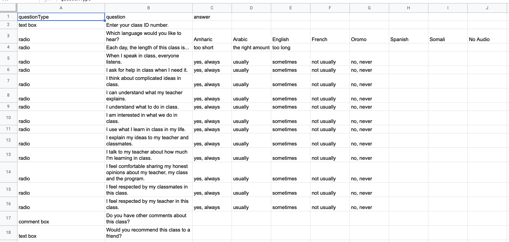

# drive-htmlform-googlesheets

## Description
1. This is a container bound script, though it doesn't need to be that way.  
2. Google Apps Script reads a google Sheet to to dynamically write Html survey.
3. The script reads a spreadsheet and creates a paginated survey for each question is finds in the sheet (whatever you add to the sheet, it will generate on the survey).  
4. In addition, it requires a language selection and audio interprets the English text to the selected language if it finds an audio file in the Drive that matches the text and the language selction.
5. It then records responses to a Google Sheets. 

## Known Issue with Safari Browser
**Using Safari - Must enable cross-site tracking or Google with block access to audio file folders.**
Users' cross-site tracking cannot be disabled in Safari settings (appears to be unique to Safari).  Audio will not load from G Drive.  You can turn it off in preferences - it is a user setting.  Would be good to write something to check for it and generate and error.  

***

## Set-up:
1. Create a new Google spreadsheet with separate sheets: [Responses, Survey Questions, Class Directory]
    
    - *Setting up 3 Sheets*
        

    ***

    -   *Creating Columns for Survey Questions - Adding Some Questions*
        

    ***

    - *Creating Some Classes - Use These Columns - Check Code to See What's Used and What Isn't"
        

    ***

2. Also, create a folder called "Survey Audio Files" and place the audio that you would like to accompany each question and each possible response.  You should have one sub-folder for each language that you will support, e.g. "Spanish Audio".  My survey is delivered in English, but has audio interpretation in, Amharic, Arabic, French, Hmong, Nepali, Oromo, Somali, Spanish, and Tigrina. You don't have to have those.  Just include languages that you want.  

    *Setting up Drive Folders for the Languages You Want*
    

    ***

3. Record audio interpretation of the text - questions and responses.  When you name each audio file, it must exactly match the text of the question from your "Survey Questions" sheet (always in English) including capitalization and punctuation and keep them in language-designated folders. 

    *Adding Language Files - Take Care to Match File Names to Question Text or It Won't Work"*
    

4. From Google Sheet, click on the "Tools" menu and seclect "Script Editor".  Create the file structure and past in the code from this repo. 

    *Set up the Files in Script Editor"
    

5. The code is fairly well commented.  You should be able to make it work if you get the files set up correctly.

***

See a working version at:  https://script.google.com/macros/s/AKfycbytNQgCuNU8c_jYnvfX7oaFt8gKd66FlnK2Tq0P6Qwp/dev
The spreadsheet it draws from and writes to:  https://docs.google.com/spreadsheets/d/1OOkymmDbcj-52bbztmNGnEgIOwVodLPpNNg9Ao0naIs/edit?usp=sharing

Thank you to Chicago Computer Classes YouTube Channel (https://www.youtube.com/c/LearnGoogleSpreadsheets/featured) where I learned to do most of what follows.
